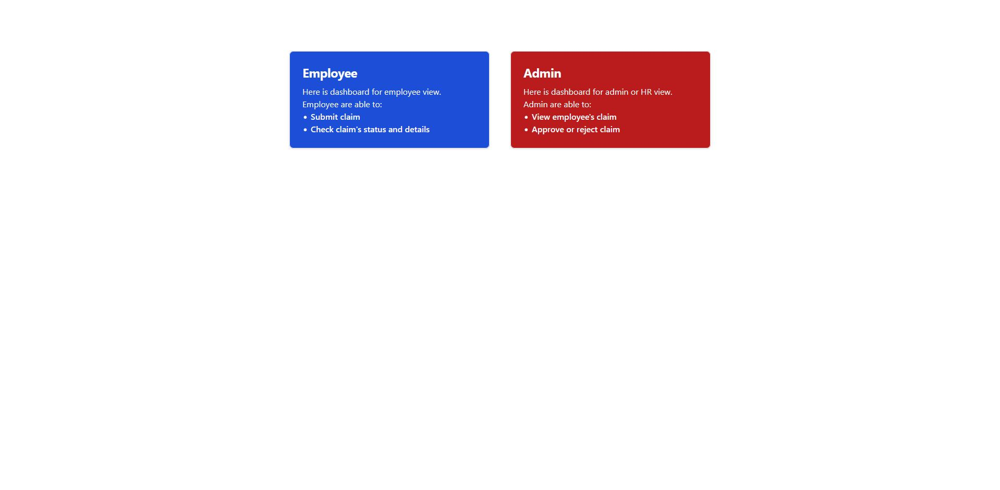
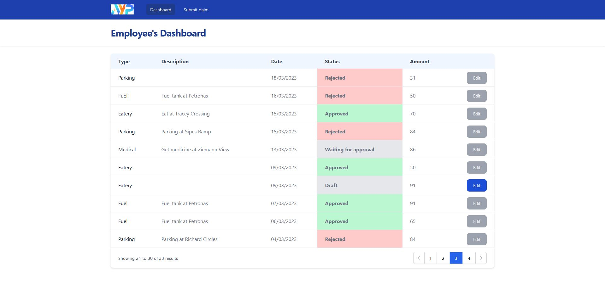
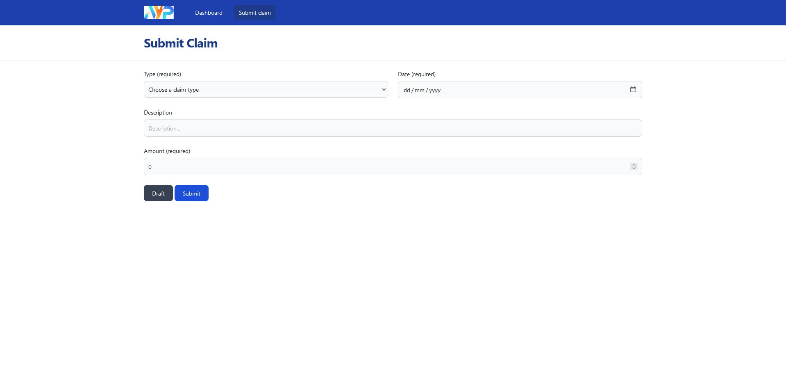
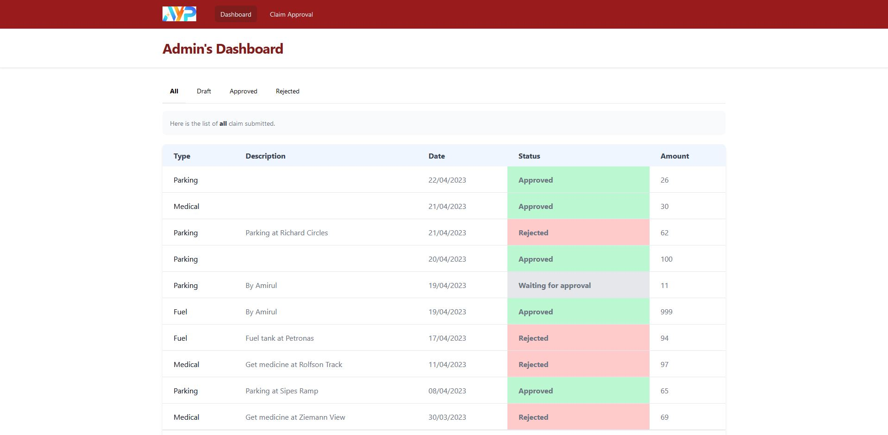
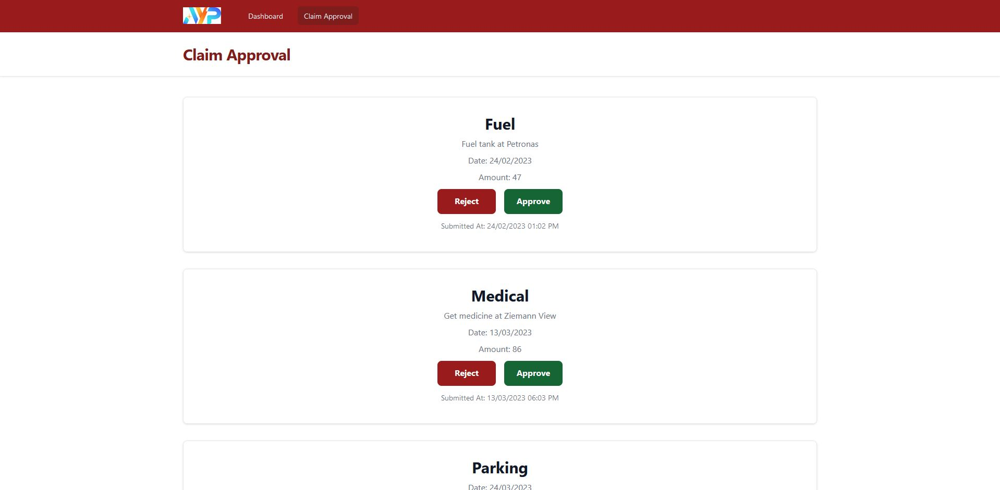

<p  align="right">
<a  href="https://ayp-group.com/"  target="_blank"></a></p>
<p  align="right"><a  href="https://laravel.com"  target="_blank"></a>
</p>

## **Assignment background**

By using Laravel version 10 is required to develop a simple claim submission module
WITHOUT user login module. The claim submission modules consist of two major sub-modules:

- Dashboard which displays all the claim(s) submitted and corresponding
status (approved, rejected, waiting for approval). By clicking on a claim we
expect to see the details
- Claim submission where user can submit their claims

Side note: This system is not expecting any approval level at this point, meaning can just update the status directly from database.

## **Technology stack used**

- [Laravel](https://laravel.com)
- [InertiaJS](https://inertiajs.com/)
- [Svelte](https://svelte.dev/)

## **Additional packages used**

- [Laravel Octane](https://laravel.com/docs/10.x/octane)
- [Spatie Ray](https://spatie.be/docs/ray/v1/introduction)
- [TailwindCSS](https://tailwindcss.com)
- [Chokidar](https://github.com/paulmillr/chokidar)

---

## **Getting Started**

### **Requirements**

The only requirement is install [Docker](https://docs.docker.com/)

### **Installation**

1. Clone this repo
    ```
    git clone https://github.com/naimsolong/ayp-assignment.git
    ```

2. Go to project directory and copy environment file
    ```
    cd ayp-assignment
    cp .env.example .env
    ```

3. Build the docker image and run container
    ```
    docker compose up --build -d
    ```

4. After the container is running, then you can access this web app by ```localhost:8000```

### **Additional Note**

1. To run a command inside docker container
    ```
    docker exec -it ayp-app /bin/bash
    ```

2. There are a few things you can do when running command inside docker container

    2.1 Get current environment configuration

    ```
    php artisan about
    ```

    2.2 Access into DB

    ```
    php artisan db
    ```

    2.3 Get available route

    ```
    php artisan route:list
    ```

    2.4 Seed some fake data

    ```
    php artisan db:seed
    ```

    2.5 Run test

    ```
    php artisan test
    ```

---

## **Guideline**

### **Base page**

Here is the base page where you can access as employee or admin.

As an employee, you are able to:
- Submit claim
- Check claim's status and details

As an admin, you are able to:
- View employee's claim
- Approve or reject claim



### **Employee page**


By clicking blue card from base page, you are able to see employee dashboard point of view.

From here there are four status:
- Draft
- Waiting for approval
- Approval
- Rejected

As you can see only for Draft status claim, there are blue button that allow employee to edit claim again. The edit page is similar to Submit Claim page.



This is Submit Claim where employee is allow to do claim submission. You are required to fill in for type, date and amount input field, whereas description is optional.

Please do note that there two button:
- Draft button: Allow employee to create draft of claim submission
- Submit button: Finalize claim submission and won't be able to edit again

These button has same function when editing the claim.



### **Admin page**


Next, by clicking red card from base page, you are able to see admin dashboard point of view.

From here there four tab to filter out the claim based on status:
- All
- Draft
- Approved
- Rejected



For the Claim Approval page, the list of submitted claim is in card form. Once you click either Reject or Approve button, the selected card will disappear.



---

That would be all, thank you!

If you have any question, feel free to ask.
